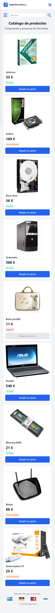
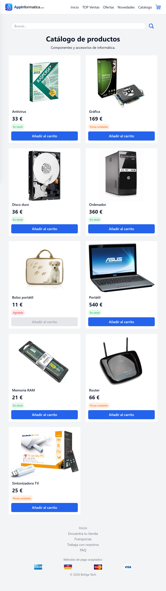
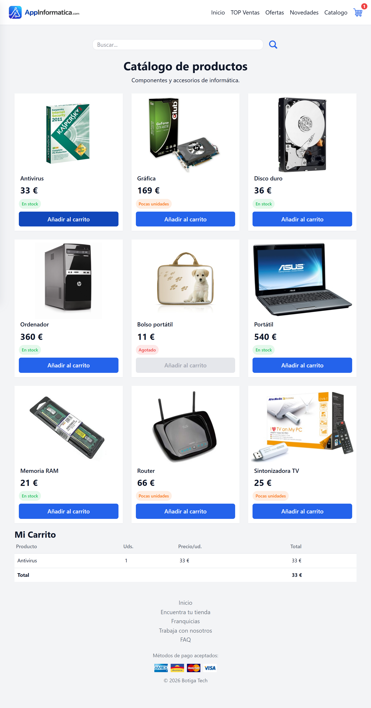

# Tech Shop — Modernización de una tienda online

This project is a modernization of an old computer hardware online store originally written around 2010.
The goal was to rebuild the entire catalog page from scratch using modern HTML5 semantic structure and responsive CSS, replacing outdated techniques like absolute positioning, fixed layouts, and non-standard CSS and Tailwind.

The focus of the exercise is clean layout, accessibility, responsive design and semantic markup, not JavaScript functionality.

## Table of contents

- [Overview](#overview)
  - [The challenge](#the-challenge)
  - [Screenshot](#screenshot)
- [My process](#my-process)
  - [Built with](#built-with)
  - [What I learned](#what-i-learned)
  - [Continued development](#continued-development)
  - [Useful resources](#useful-resources)
  - [AI Collaboration](#ai-collaboration)
- [Author](#author)
- [Acknowledgments](#acknowledgments)

## Overview

### The challenge

The challenge was to modernize an outdated online store layout and rebuild it using modern front-end best practices.

The original version had several problems:
- Outdated XHTML 1.0 Transitional doctype
- Layout created with absolute positioning
- Fixed widths and no mobile support
- No semantic structure (everything was 
)
- Non-standard CSS properties like display: yes
- JavaScript injecting HTML with innerHTML

The task was to recreate the product catalog with:
- Semantic HTML landmarks
- Accessible product cards
- Responsive layout
- CSS Grid for the product catalog
- Mobile-first design
- Clean typography and spacing

The page includes:

- Site header and navigation
- Product catalog
- Shopping cart table (static HTML)
- Footer with credits and payment icons

### Screenshot

## My process

### Built with

- Semantic HTML5
- CSS Custom Properties (variables at :root)
- Tailwind Css
- CSS Grid for the product catalog
- Flexbox for component alignment
- Mobile-first workflow
- Responsive design with min-width media queries
- Google Fonts — Inter

### What I learned

### Continued development

### Useful resources

### AI Collaboration

## Author

## Acknowledgments
